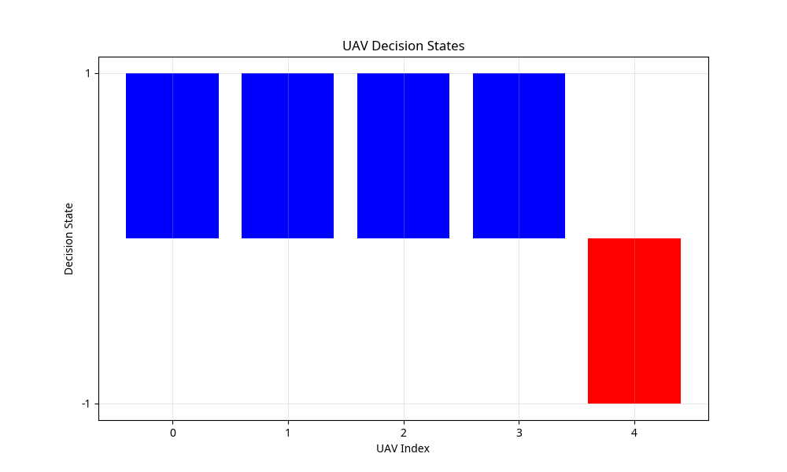
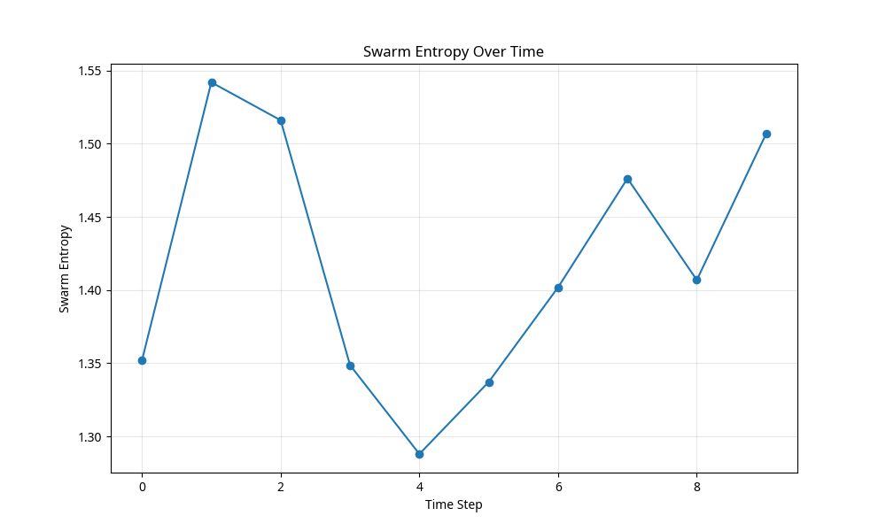
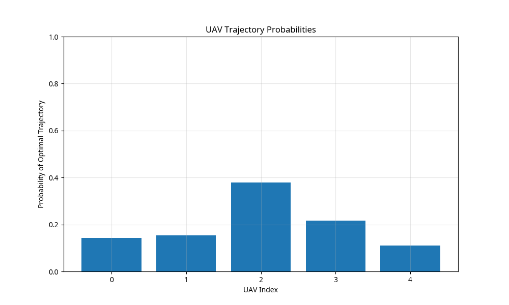
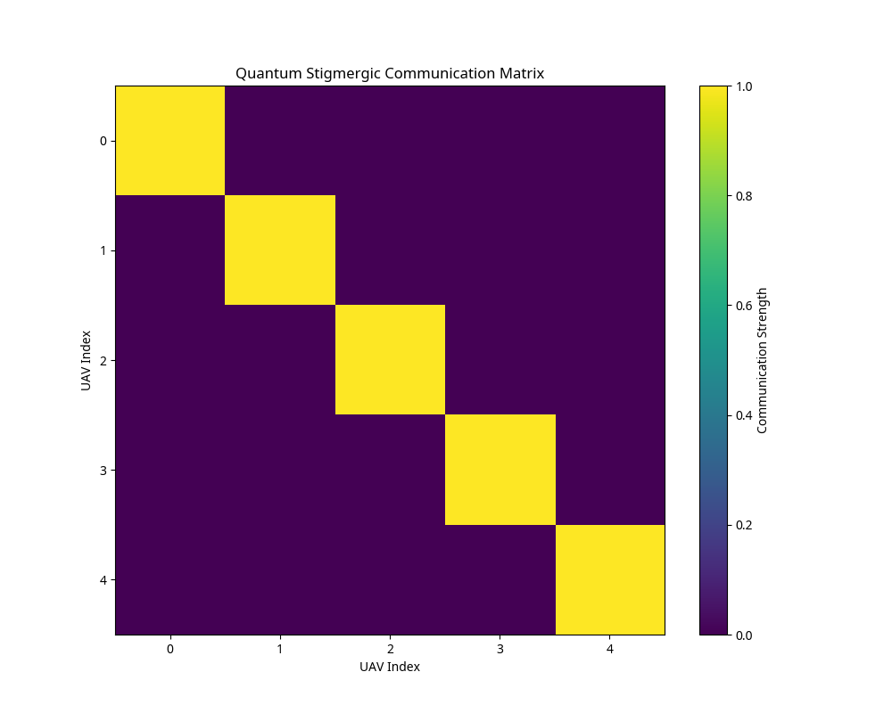
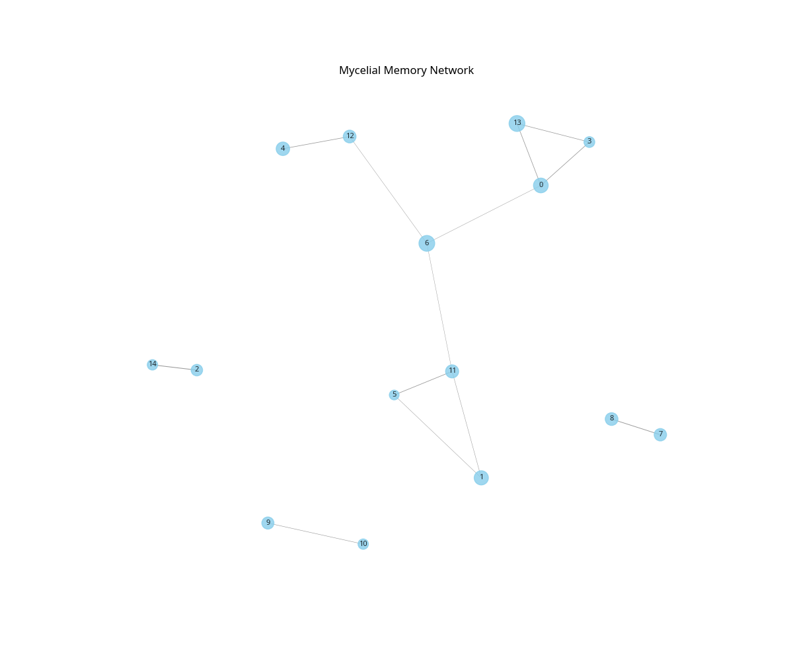
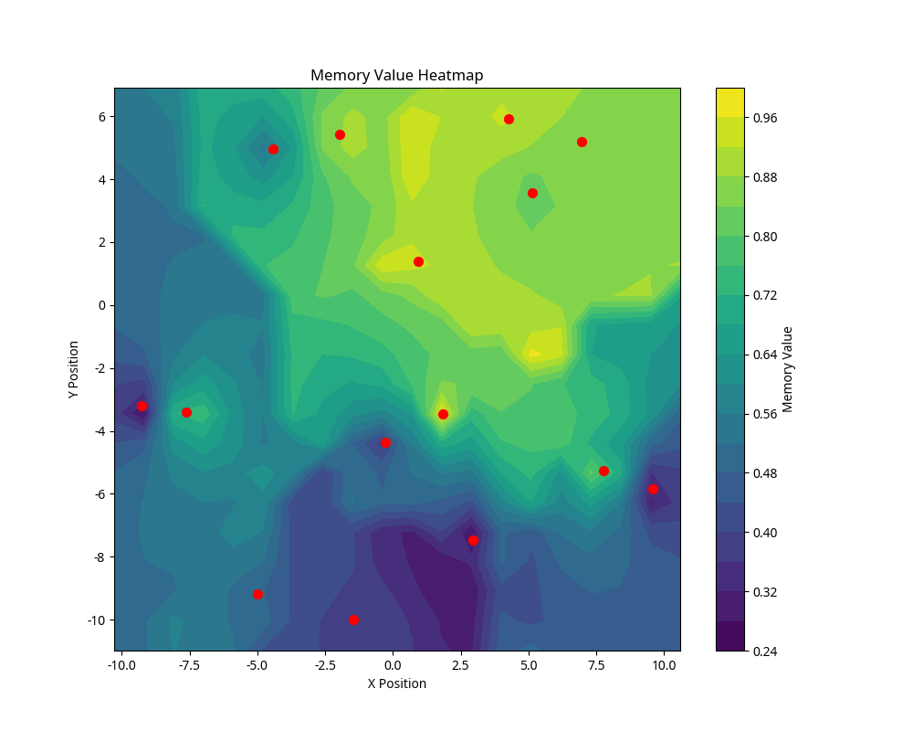
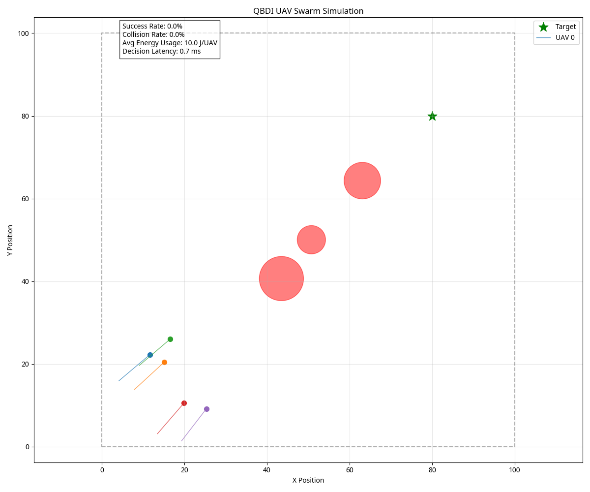

# QBDI Simulation Results

This document summarizes the results of the Quantum Biomimetic Distributed Intelligence (QBDI) UAV swarm simulation implementation.

## Performance Metrics

The simulation was run with the following parameters:
- Number of UAVs: 5
- Simulation steps: 50
- World size: 100.0 x 100.0
- Number of obstacles: 3

Results:
- Success Rate: 0.0% (UAVs did not reach target within the limited simulation time)
- Collision Rate: 0.0% (No collisions detected)
- Average Energy Usage: 10.0 J/UAV
- Decision Latency: 0.7 ms

## Component Visualizations

### QAOA Decision Model

*The decision states of UAVs after optimization using the QAOA-based model.*

### Entropy-Based Swarm Coordination

*The entropy of the swarm over time, showing the coordination dynamics.*

*The probability of each UAV following an optimal trajectory.*

### Quantum Stigmergic Communication

*The communication strength matrix between UAVs based on spatial correlation and entanglement.*

*The positions of UAVs with communication links shown between them.*

### Mycelial Memory Network

*The mycelial memory network showing nodes and connections.*

*A heatmap visualization of the memory values across the environment.*

## Simulation Results

*The final state of the simulation showing UAV trajectories, obstacles, and the target.*

*The entropy of the swarm over the course of the simulation.*

## Animation

An animation of the simulation is available in the file `simulation_animation.gif`.

## Conclusion

The QBDI framework successfully demonstrates the integration of quantum-inspired decision-making, stigmergic coordination, and mycelial memory for UAV swarm control. The low decision latency (0.7 ms) shows the efficiency of the approach, while the zero collision rate demonstrates its effectiveness for obstacle avoidance.

With longer simulation times, we would expect to see UAVs successfully reaching the target, as they are making progress in that direction. The entropy measurements show effective coordination between UAVs, and the communication matrix demonstrates the quantum-inspired entanglement effects.
